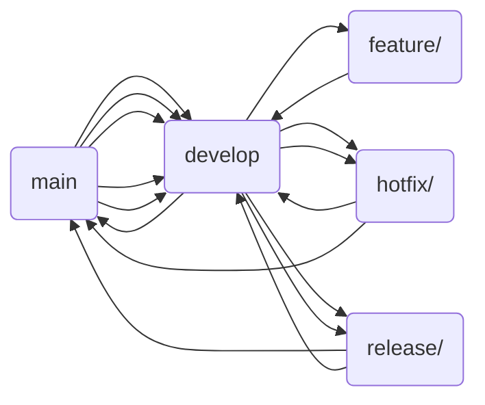

## Branching Strategy

>   Developers at [No Clocks](https://github.com/noclocks) should strive to utilize [Git Branching Best Practices]() across all projects. Our strategy revolves around [Git Flow](), [GitHub Flow](), and [Trunk-Based Development]() Principals.

### Git Flow

Git Flow is a branching model for Git, designed by Vincent Driessen. It's a structured way of managing branches in a repository to streamline the development process, feature integration, releases, and maintenance. The Git Flow model emphasizes the use of separate branches for different purposes, such as new features, releases, and hotfixes, ensuring a clean and organized project history. Below is an explanation of the primary branches and their roles in the Git Flow model, along with a conceptual diagram of how they interact.

The primary branches in the Git Flow Model are:

-   `main`: This branch stores the official release history. It should be stable and deployable at any time.
-   `develop`: Derived from the main branch, this branch serves as an integration branch for features. It's where daily development happens and where feature branches merge back into.

Then there are various “supporting”branches such as:

-   `feature/`: Feature branches should branch off from `develop` and merge back into `develop`. Each feature branch is dedicated to building a specific feature and is named accordingly (e.g., `feature/new-login-page`).
-   `release/`: Release branches branch off from `develop` and merge into *both `develop` and `main`.* These branches are used for preparing a new production release. They allow for minor bug fixes and preparing metadata for a release (version number, build dates, etc.). A release branch is named with the release version number (e.g., `release/v1.2.0`).

-   `hotfix/`: Hotfix branches branch off from `main` and merge back into *both `develop` and `main`.* These are used to quickly patch live production issues. Like release branches, they are named with the version number, but with a hotfix prefix (e.g., `hotfix/v1.2.1`).

### Git Flow Conceptual Diagram

-   Developer starts initial development on the `develop` branch
-   Developer creates a `feature/` branch from `develop` and begins work for a specific feature
-   Once a feature is completed, its code gets pushed to the upstream, remote `feature/` branch and eventually merged back into `develop` via a pull-request
-   Once enough features have been completed, it is time for a new release. A `release/` branch is created from `develop`. Modifications for the release are made in the new `release/` branch. After the release is finalized, it’s merged back into both `develop` and `main`
-   Hotfixes (`hotfix/`) are created from `main` to quickly address issues in production. Once completed, they are merged back into both `main`  and `develop`
-   The `main` branch hold the official release history.

This model supports a disciplined way of releasing software and managing fixes, making it easier to track and manage the development process's complexity.

### Branches

- `main`: production branch (besides initialization, should only be interacted with by merging from `develop` into `main`)
- `develop`: primary development branch (all `feature/`, `bugfix/`, `hotfix/` branches merge into `develop` and once stable then merge into `main`)
- `feature/<featureName>`: feature branches (atomic, individual branches that are general created in conjunction with a feature issue)
- `bugfix/<bugName>`: bug fix branches (same as feature but for bugs)
- `hotfix/<hotfixName>`: hot fixes for production level bug fixes
- `release/v<semver>`: release branches