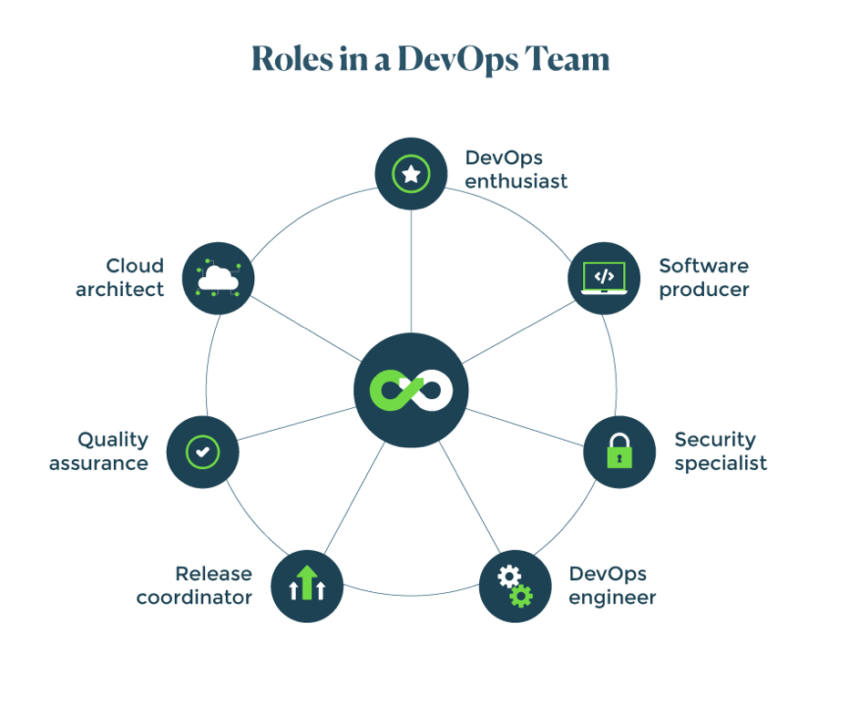

# DevOps

> Many companies adopt the DevOps strategy to make communication between developers and operations faster and accelerate the software development phase while making business more agile. To properly implement the DevOps methodology, you’ll need more than the right tools. Having the right team is essential in finding success with DevOps.

Here are seven of the essential roles in a DevOps team:

1.  DevOps enthusiast
2.  Release coordinator
3.  Cloud architect
4.  Software producer
5.  Quality assurance
6.  Security specialist
7.  DevOps engineer
