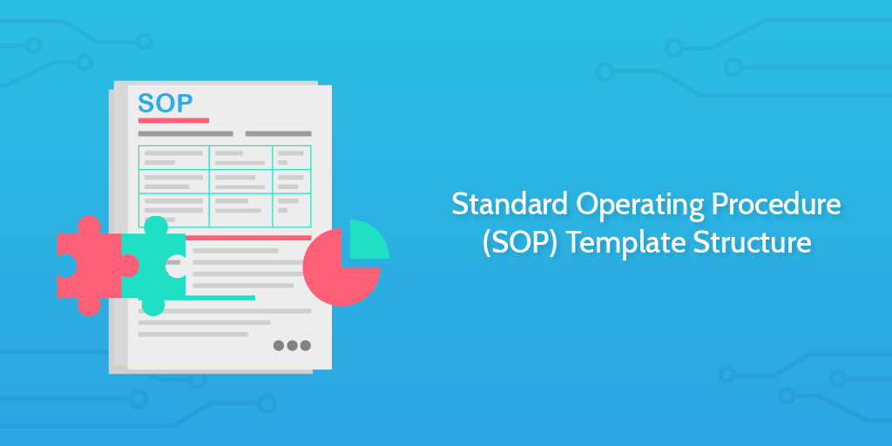

# Standard Operating Procedure Template

> Standard Operating Procedure (SOP) Template Structure.

## Overview

The purpose of this standard operating procedure (SOP) template is to provide the necessary structure from which to create your own procedures.

## [Procedure Title]

**Revision Date**: [Date]
**Revision Number**: [Number]
**Revision Author**: [Author]

##  Table of Contents

## Scope

## Purpose

-   SOP Title
-   Creation Date
-   Responsible Department/People
-   Embedded Loom Recording

## Contents

## Purpose

>   Summarize the procedure and its goal.

## Context

>   Add any relevant, related, and useful information about the process here.
>
>   Embed Documents, etc.

## Taxonomy

>   Add any unfamiliar or domain-specific words and their definitions.

## Tools

>   Add relevant tools associated with this process

## Roles & Responsibilities

>   Define who will be executing the activities related to the SOP.

## Procedure

>   Create a step by step procedure to complete this process. Add Miro boards, screen recordings and images to provide a visual aid.

>   Embed Loom

>   Embed Mindmap
